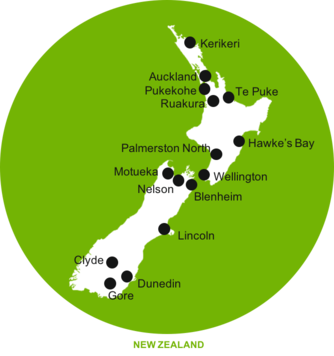
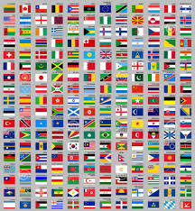
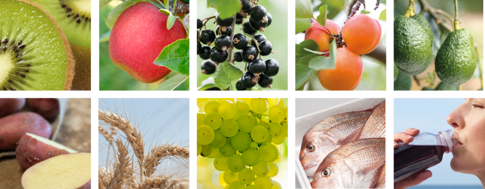
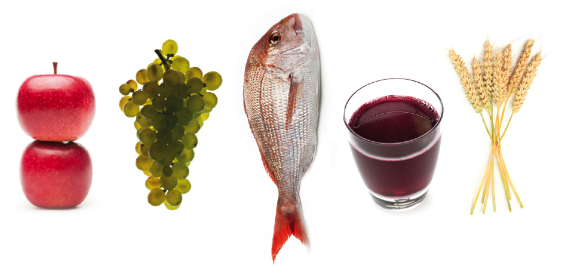

#Structure of the Team

## The Team Distribution

<div class="columns-2">

- Auckland 6
- Lincoln 3
- Te Puke 2
- Palmerston North 2.5




</div>

## Origin

<div class="columns-2">

- China
- New Zealand
- England
- Scotland
- France
- Sri Lanka
- USA
- Germany



</div>

## Social Aspects

- 30% Women
- Age evenly distributed from mid 20s to 60s

# Dimensions of Support

## Species




## Support for Research Areas

- Genome Assembly / gene prediction / Pan genomes
- Variant Calling
- Metagenomics
- Small/Micro RNA
- Gene Expression Analyses
- Machine Learning

## Technologies

- Short read genome assembly (Illumina)
- Long Read Genome assembly (PacBio, minion)
- GBS
- Captcha seq
- RNAseq
- Machine learning / neural nets
- Augustus, BRAKER2
- ...

# Slide One | Click here to edit { .slide.. }

## Slide Two | Notice the pipe symbol separates title and subtitle

<div id="slide-two-asciinema"></div>
<script>
  asciinema.player.js.CreatePlayer(
    'slide-two-asciinema',
    'json/asciinema-hello-world.json',
    {
      width: 80,
      height: 20,
      theme: 'tango'
    });
</script>

## Slide Three {.titled..}

A Subtitle is **not** required. Some thing about **font** sizes:

1. <font size=1>text</font>
2. <font size=2>text</font>
3. <font size=3>text</font>
4. <font size=4>text</font>
5. <font size=5>text</font>
6. <font size=6>text</font>
7. <font size=7>text</font>

# Slide Four {data-background=img/apricot-title.png}

## Slide Five {.titled.. .smaller}

This slide has smaller fonts.

The available font sizes are

- `tiny`
- `smaller`
- `larger`
- `huge`

## Slide Six

This is `tiny`.

## Slide Six point Five

This is `huge`.

## Slide Seven {.larger}

This is `larger` and has code

```{r echo=TRUE, results='hide'}
Sys.getenv("HOME")
```

## Slide Eight - two column layout

<div class="columns-2">
- one
- two
- three
- four
- five
- one
- two
- three
- four


</div>

## Slide Nine - two column layout {.titled..}

<div class="columns-2">


- one
- two
- three
- four
- five
- one
- two
- three
- four
</div>

# {data-background=img/seafood-background.png}

<div class="circle green-3px">
<div>
<span class="title">Seafood Technologies</span>
<span class="subtitle">Maximising value from seafood resources</span>
<p>New technologies for the sustainable harvest and processing of high value marine products</p></div>
</div>
